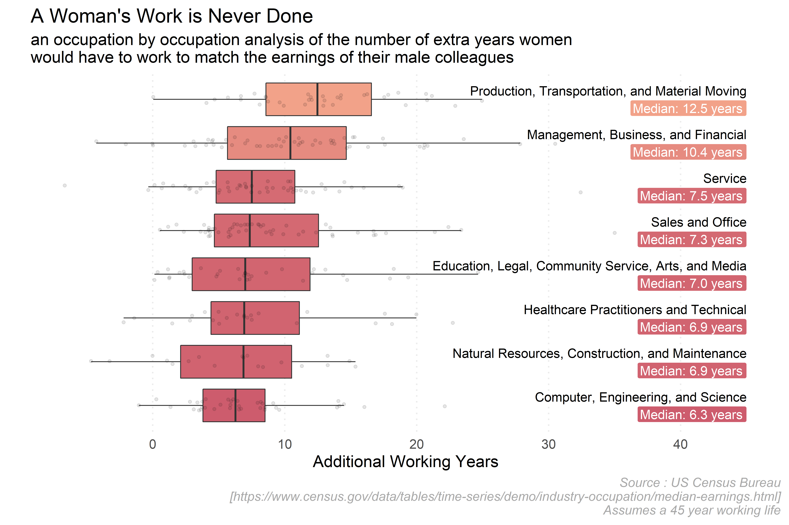

# Gareth's Tidy Tuesday Efforts

This is a repository to store and showcase my own [Tidy Tuesday](https://github.com/rfordatascience/tidytuesday) efforts.

# Effort 1 - Space Races

This week, the data was a summary of every rocket launch since humans started firing things into space. There was a whole heap of interesting metadata, including things like the agency responsible and the names of the rockets used - which might have lent itself to analysis of famous series of rocket launches like Saturn or Apollo - but I kept things simple with an analysis of launches by country:

 

# Effort 2 - Got Milk?

This week was a chance to get my map on. I stuck with what I know and mapped using `ggplot2`, but I've been meaning to use newer packages such as `sf` and `cartography`, so will aim to use these next time. 

 

# Effort 3 - PhDs

My most recent [#tidytuesday](https://twitter.com/hashtag/tidytuesday?lang=en) concerned the subjects in which PhDs were awarded in the US since 2007. I was interested which subjects had increased or decreased in popularity in their own right, and was happy to see that the popularity of Mathematics/Statistics was on the up.

# Effort 4 - Female Earnings

A topic I have suprisingly strong opinions about, I created a chart which, with some basic assumptions around the length of an average career, how much longer women across industries would have to work in order to earn as much as their male equivalents.

